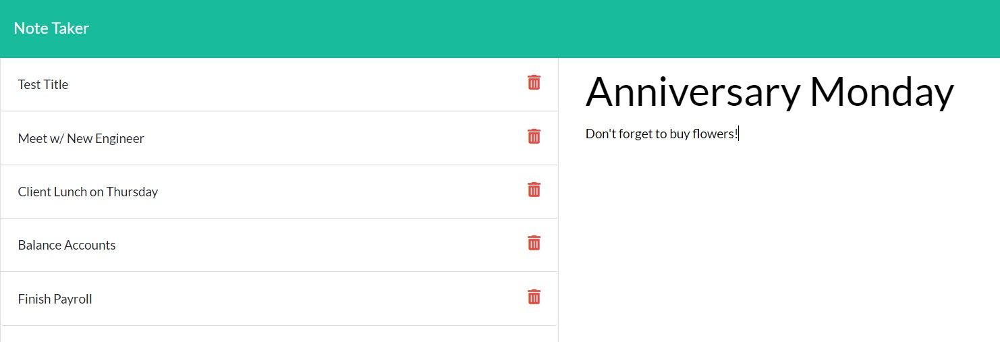

# Express.js Based Note Taker

## Table of Contents
  * [Description](#description)
  * [Technologies](#technologies-used)
  * [Demonstration](#demonstration)
  * [Installation](#installation)
  * [License](#license)

## Description
This project uses nodejs and express.js to locally host a browser-based note taking applicaiton. This project can be used by anyone intuitively and has an easy to understand functionality. Simply title the note, add text, click save, and you're done! There is a handy delete button that removes completed ideas.

## Technologies
* [nodejs](https://nodejs.org/en/)
* [express.js](https://expressjs.com/)


## User Story
```
AS A small business owner
I WANT to be able to write and save notes
SO THAT I can organize my thoughts and keep track of tasks I need to complete
```
## Demonstration


## Installation
* For installation onto local machine, clone provided repository.
* Use `npm install` to install dependencies.
* Use `npm run dev` to initiate the server in your terminal.
* Visit `http://localhost:3000/` in your browser. Default provided port is 3000.