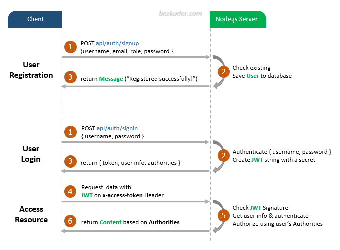

# Node.js – JWT Authentication & Authorization example with JSONWebToken & Sequelize

## User Registration, User Login and Authorization process.
The diagram shows flow of how we implement User Registration, User Login and Authorization process.



For more detail, please visit:
> [Node.js JWT Authentication & Authorization example](https://bezkoder.com/node-js-jwt-authentication-mysql/)

You may need to implement Refresh Token:


> [Node.js JWT Refresh Token example](https://bezkoder.com/jwt-refresh-token-node-js/)

> [Integrate React with Node.js Express](https://www.bezkoder.com/integrate-react-express-same-server-port/)

## Project setup
```
npm install
```

### Run
```
node server.js
```
